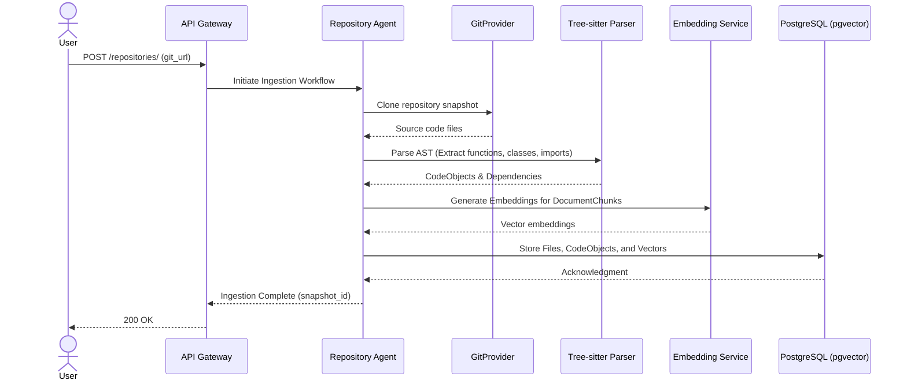
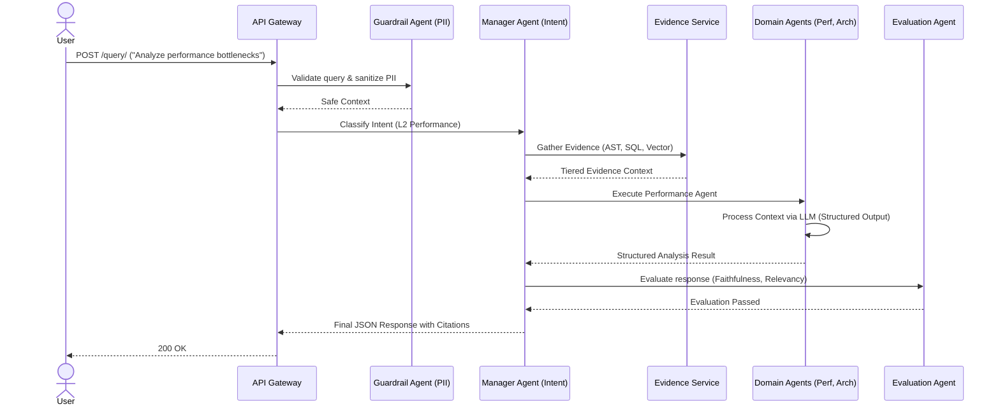
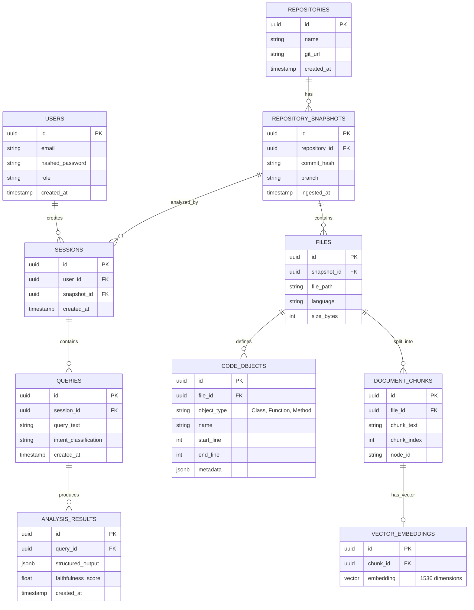
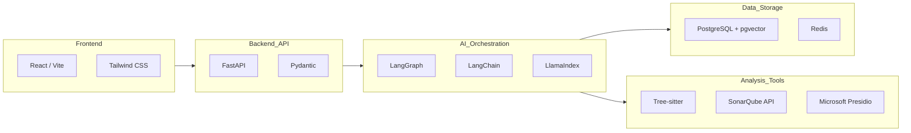

# Autonomous Code Quality & Optimization Intelligence System - Final Documentation

## Table of Contents
- [1. System Architecture](#1-system-architecture)
  - [1.0 Core Agents & Responsibilities](#10-core-agents--responsibilities)
  - [1.0.1 Tooling & Function Calling (The Agent Arsenal)](#101-tooling--function-calling-the-agent-arsenal)
  - [1.1 Prompt Design & Engineering Patterns](#11-prompt-design--engineering-patterns)
  - [1.2 Use Cases & Target Personas](#12-use-cases--target-personas)
  - [1.3 Success Definition & KPIs](#13-success-definition--kpis)
- [1.5 Detailed Solution Design (Data & Execution Flows)](#15-detailed-solution-design-data--execution-flows)
- [2. Database Design & ER Diagram](#2-database-design--er-diagram)
  - [2.1 Complete Entity-Relationship (ER) Diagram](#21-complete-entity-relationship-er-diagram)
  - [2.2 Detailed Schema Definitions](#22-detailed-schema-definitions)
- [3. Technology Stack & Dependencies](#3-technology-stack--dependencies)
- [4. API Endpoints](#4-api-endpoints)
  - [4.1 Repository Ingestion](#41-repository-ingestion-repositories)
  - [4.2 Query API](#42-query-api-query)
  - [4.3 Executions API](#43-executions-api-executions)
  - [4.4 Escalation API](#44-escalation-api-escalation)
  - [4.5 Streaming & WebSocket APIs](#45-streaming--websocket-apis)
  - [4.6 Operational API](#46-operational-api-operational)
- [5. Architecture Design Records (ADR)](#5-architecture-design-records-adr)

## 1. System Architecture

The system utilizes a Multi-Agent State Machine (orchestrated via LangGraph) decoupled from a high-performance HTTP layer (FastAPI) and background workers (Celery).

### Architecture Diagram

```mermaid
flowchart TD

%% =========================================================
%% GLOBAL STYLES
%% =========================================================

classDef client fill:#E8EAF6,stroke:#3949AB,stroke-width:2px,color:#111;
classDef api fill:#E3F2FD,stroke:#1565C0,stroke-width:2px,color:#111;
classDef agent fill:#E8F5E9,stroke:#2E7D32,stroke-width:2px,color:#111;
classDef workflow fill:#FFF8E1,stroke:#F9A825,stroke-width:2px,color:#111;
classDef tool fill:#FBE9E7,stroke:#D84315,stroke-width:2px,color:#111;
classDef service fill:#F3E5F5,stroke:#7B1FA2,stroke-width:2px,color:#111;
classDef retrieval fill:#E0F7FA,stroke:#00838F,stroke-width:2px,color:#111;
classDef data fill:#ECEFF1,stroke:#455A64,stroke-width:2px,color:#111;
classDef external fill:#FFF3E0,stroke:#EF6C00,stroke-width:2px,color:#111;
classDef decision fill:#FFFDE7,stroke:#F57F17,stroke-width:2px,color:#111;

%% =========================================================
%% 1. CLIENT / ENTRY
%% =========================================================

CLIENT["HTTP / WebSocket Client"]:::client

CLIENT --> API

subgraph API_LAYER["API & APPLICATION LAYER"]

    API["FastAPI Application"]:::api

    ROUTERS["API Routers
    • Ingestion
    • Query
    • Repositories
    • Sessions
    • Executions
    • Operational
    • Escalation"]:::api

    MIDDLEWARE["Middleware
    • Authentication
    • Dependencies
    • Error Handling"]:::api

    API --> ROUTERS
    ROUTERS --> MIDDLEWARE

end

%% =========================================================
%% 2. INGESTION
%% =========================================================

MIDDLEWARE --> INGEST

subgraph INGESTION_LAYER["REPOSITORY INGESTION & CODE UNDERSTANDING"]

    INGEST["Repository / Document Ingestion"]:::tool

    GIT["Git Sync / Repository Loader"]:::tool

    DOC_PARSER["Document Parser"]:::tool

    UNIVERSAL_PARSER["Universal Parser"]:::tool

    TREE_SITTER["Tree-Sitter Parser"]:::tool

    AST_INDEX["AST Indexer"]:::retrieval

    CHUNK_BUILDER["Chunk Builder"]:::retrieval

    DEP_GRAPH["Dependency Graph Builder"]:::retrieval

    INGEST --> GIT
    INGEST --> DOC_PARSER
    GIT --> UNIVERSAL_PARSER
    UNIVERSAL_PARSER --> TREE_SITTER
    TREE_SITTER --> AST_INDEX
    AST_INDEX --> CHUNK_BUILDER
    AST_INDEX --> DEP_GRAPH

end

%% =========================================================
%% 3. INDEXING / RETRIEVAL
%% =========================================================

CHUNK_BUILDER --> INDEXING
DEP_GRAPH --> INDEXING

subgraph RETRIEVAL_LAYER["HYBRID RETRIEVAL & CODE SEARCH"]

    INDEXING["Indexing Pipeline"]:::retrieval

    VECTOR["Vector Store
    pgvector / Embeddings"]:::retrieval

    BM25["BM25 Retriever"]:::retrieval

    HYBRID["Hybrid Retriever
    BM25 + Vector + RRF"]:::retrieval

    RERANKER["Reranker"]:::retrieval

    PLANNER["Query Planner"]:::retrieval

    SUMMARIZER["Code Summarizer"]:::retrieval

    INDEXER["Retrieval Indexer"]:::retrieval

    INDEXING --> INDEXER
    INDEXER --> VECTOR
    INDEXER --> BM25

    PLANNER --> HYBRID
    VECTOR --> HYBRID
    BM25 --> HYBRID
    HYBRID --> RERANKER
    RERANKER --> SUMMARIZER

end

%% =========================================================
%% 4. WORKFLOW ORCHESTRATION
%% =========================================================

MIDDLEWARE --> GUARDRAIL

subgraph ORCHESTRATION["LANGGRAPH WORKFLOW / ORCHESTRATION"]

    GUARDRAIL["GuardrailAgent
    Prompt Injection / Malicious Intent / Off-topic"]:::agent

    GUARD_DECISION{"Safe Query?"}:::decision

    MANAGER["ManagerAgent
    Supervisor / Intent Router"]:::agent

    PLAN["Execution Plan
    Workflow Type
    Agents
    Dependencies
    Parallelism"]:::workflow

    GUARDRAIL --> GUARD_DECISION

    GUARD_DECISION -->|No| BLOCK["Blocked / Policy Error"]:::decision
    GUARD_DECISION -->|Yes| MANAGER

    MANAGER --> PLAN

end

%% =========================================================
%% 5. SPECIALIZED AGENTS
%% =========================================================

PLAN --> REPOSITORY_AGENT
PLAN --> DOCUMENTATION_AGENT
PLAN --> QUALITY_PIPELINE
PLAN --> ANALYSIS_GROUP

subgraph AGENT_LAYER["SPECIALIZED AGENTS"]

    REPOSITORY_AGENT["RepositoryAgent
    Repository Context / Snapshot"]:::agent

    DOCUMENTATION_AGENT["DocumentationAgent
    Documentation / README / Code Explanation"]:::agent

    subgraph ANALYSIS_GROUP["ANALYSIS AGENTS"]

        ARCH_AGENT["ArchitectureAgent
        Architecture / Design Analysis"]:::agent

        COVERAGE_AGENT["TestCoverageAgent
        Test / Coverage Analysis"]:::agent

        PERFORMANCE_AGENT["PerformanceAgent
        Performance / Bottleneck Analysis"]:::agent

    end

    EVALUATION_AGENT["EvaluationAgent
    Evidence / Hallucination / Quality Gate"]:::agent

    REPORTER_AGENT["ReporterAgent
    Final Report Synthesis"]:::agent

end

%% =========================================================
%% 6. AGENT TOOLS
%% =========================================================

subgraph TOOL_LAYER["AGENT TOOLS"]

    REPO_TOOLS["Repository Tools
    • clone_repository()
    • get_repository_info()"]:::tool

    PARSING_TOOLS["Parsing Tools
    • parse_source_code()
    • ingest_document()"]:::tool

    RETRIEVAL_TOOLS["Retrieval Tools
    • hybrid_search()"]:::tool

    ANALYSIS_TOOLS["Analysis Tools
    • analyze_code_quality()
    • get_code_issues()
    • get_latest_project_key()"]:::tool

    DOC_TOOLS["Documentation Tools
    • generate_readme()"]:::tool

    SQL_TOOLS["SQL Tools
    • get_sql_db()
    • execute_sql_query()"]:::tool

end

REPOSITORY_AGENT --> REPO_TOOLS

ARCH_AGENT --> PARSING_TOOLS
ARCH_AGENT --> RETRIEVAL_TOOLS

COVERAGE_AGENT --> PARSING_TOOLS
COVERAGE_AGENT --> RETRIEVAL_TOOLS

PERFORMANCE_AGENT --> PARSING_TOOLS
PERFORMANCE_AGENT --> RETRIEVAL_TOOLS
PERFORMANCE_AGENT --> SQL_TOOLS

DOCUMENTATION_AGENT --> DOC_TOOLS
DOCUMENTATION_AGENT --> RETRIEVAL_TOOLS

QUALITY_PIPELINE --> ANALYSIS_TOOLS

%% =========================================================
%% 7. QUALITY PIPELINE
%% =========================================================

subgraph QUALITY_LAYER["DETERMINISTIC CODE QUALITY PIPELINE"]

    QUALITY_PIPELINE["Quality Pipeline"]:::workflow

    QUALITY_PARSE["Repository Parser"]:::workflow

    SONAR_METRICS["SonarQube Metrics"]:::workflow

    QUALITY_REVIEW["Architecture / Quality Reviewer"]:::workflow

    QUALITY_REPORT["Quality Report Generator"]:::workflow

    QUALITY_PIPELINE --> QUALITY_PARSE
    QUALITY_PARSE --> SONAR_METRICS
    SONAR_METRICS --> QUALITY_REVIEW
    QUALITY_REVIEW --> QUALITY_REPORT

end

%% =========================================================
%% 8. EVIDENCE SERVICE
%% =========================================================

REPOSITORY_AGENT --> EVIDENCE
ARCH_AGENT --> EVIDENCE
COVERAGE_AGENT --> EVIDENCE
PERFORMANCE_AGENT --> EVIDENCE
DOCUMENTATION_AGENT --> EVIDENCE

subgraph EVIDENCE_LAYER["EVIDENCE RESOLUTION & VALIDATION"]

    EVIDENCE["EvidenceService
    Parallel Evidence Gathering + Cache"]:::service

    METADATA_PROVIDER["MetadataProvider"]:::service

    SQL_PROVIDER["SQLProvider"]:::service

    SONAR_PROVIDER["SonarProvider"]:::service

    VECTOR_PROVIDER["VectorProvider"]:::service

    EVIDENCE_VALIDATOR["EvidenceValidator"]:::service

    EVIDENCE --> METADATA_PROVIDER
    EVIDENCE --> SQL_PROVIDER
    EVIDENCE --> SONAR_PROVIDER
    EVIDENCE --> VECTOR_PROVIDER

    METADATA_PROVIDER --> EVIDENCE_VALIDATOR
    SQL_PROVIDER --> EVIDENCE_VALIDATOR
    SONAR_PROVIDER --> EVIDENCE_VALIDATOR
    VECTOR_PROVIDER --> EVIDENCE_VALIDATOR

end

%% =========================================================
%% 9. RETRIEVAL CONNECTION
%% =========================================================

VECTOR_PROVIDER --> HYBRID

%% =========================================================
%% 10. EVALUATION
%% =========================================================

ANALYSIS_GROUP --> EVALUATION_AGENT
REPOSITORY_AGENT --> EVALUATION_AGENT
DOCUMENTATION_AGENT --> EVALUATION_AGENT
QUALITY_REPORT --> EVALUATION_AGENT

EVALUATION_AGENT --> DETERMINISTIC_VALIDATOR

subgraph VALIDATION_LAYER["TWO-TIER EVALUATION"]

    DETERMINISTIC_VALIDATOR["DeterministicValidator
    Tier 1
    • Citations
    • Repository Match
    • Evidence
    • Metrics
    • Confidence"]:::service

    LLM_VALIDATOR["LLM Evaluation
    Tier 2
    • Claim Validation
    • Faithfulness
    • Hallucination Detection
    • Security Checks"]:::service

    EVAL_DECISION{"Evaluation Passed?"}:::decision

    DETERMINISTIC_VALIDATOR --> LLM_VALIDATOR
    LLM_VALIDATOR --> EVAL_DECISION

end

EVAL_DECISION -->|Retry| MANAGER
EVAL_DECISION -->|Pass| REPORTER_AGENT

%% =========================================================
%% 11. REPORTING
%% =========================================================

REPORTER_AGENT --> PROMPT_REGISTRY

subgraph REPORTING_LAYER["REPORT GENERATION"]

    PROMPT_REGISTRY["Prompt Registry"]:::service

    LLM_SERVICE["LLMService
    Azure OpenAI / OpenAI"]:::service

    REPORT_CACHE["CacheService"]:::service

    PERSISTENCE["PersistenceService"]:::service

    PROMPT_REGISTRY --> LLM_SERVICE
    LLM_SERVICE --> REPORT_CACHE
    REPORT_CACHE --> PERSISTENCE

end

%% =========================================================
%% 12. PERSISTENCE
%% =========================================================

subgraph DATA_LAYER["DATA & PERSISTENCE"]

    POSTGRES["PostgreSQL"]:::data

    PGVECTOR["pgvector
    Vector Embeddings"]:::data

    REDIS["Redis
    Cache / State"]:::data

    DB_REPOSITORIES["Repository Layer
    • RepositoryRepository
    • QueryRepository
    • SessionRepository
    • EvaluationRepository"]:::data

end

VECTOR --> PGVECTOR
PERSISTENCE --> POSTGRES
DB_REPOSITORIES --> POSTGRES
REPORT_CACHE --> REDIS

%% =========================================================
%% 13. EXTERNAL SERVICES
%% =========================================================

subgraph EXTERNAL["EXTERNAL PROVIDERS / INFRASTRUCTURE"]

    SONARQUBE["SonarQube
    Static Analysis / Quality Metrics"]:::external

    AZURE_OPENAI["Azure OpenAI / OpenAI
    LLM Completion"]:::external

    LANGFUSE["Langfuse
    Tracing / Observability"]:::external

    GIT_PROVIDER["Git Provider
    GitHub / Git Repository"]:::external

end

SONAR_PROVIDER --> SONARQUBE
SONAR_METRICS --> SONARQUBE
LLM_SERVICE --> AZURE_OPENAI
GUARDRAIL --> LANGFUSE
MANAGER --> LANGFUSE
EVALUATION_AGENT --> LANGFUSE
REPORTER_AGENT --> LANGFUSE
GIT --> GIT_PROVIDER

%% =========================================================
%% 14. SECURITY / PII
%% =========================================================

subgraph SECURITY["SECURITY"]

    PII["PIIService
    Presidio Analyzer / Anonymizer"]:::service

end

GUARDRAIL --> PII
EVALUATION_AGENT --> PII
PII --> GUARD_DECISION

%% =========================================================
%% 15. FINAL RESPONSE
%% =========================================================

PERSISTENCE --> RESPONSE["Final Response
HTTP / WebSocket"]:::client
BLOCK --> RESPONSE
```

<details>
<summary><b>🗺️ Click to expand full System Architecture Diagram</b></summary>



</details>

### 1.0 Core Agents & Responsibilities
The system orchestrates a swarm of highly specialized agents, each responsible for a distinct vertical of the codebase analysis lifecycle:

1. **Guardrail Agent (Security & Compliance)**
   - **Responsibility**: Acts as the first line of defense. Intercepts incoming code chunks and user queries, scrubbing them for Personally Identifiable Information (PII), proprietary API keys, and internal IP addresses using Microsoft Presidio before the payload ever reaches an external LLM provider.
2. **Manager Agent (Intent & Triage)**
   - **Responsibility**: Operates as the central routing hub. Uses fast, deterministic Regex heuristics to classify the user's intent (e.g., L1 File Lookup vs L4 Deep Refactor) and delegates the task to the appropriate domain agent, drastically saving on token costs and latency.
3. **Repository Agent (Ingestion & Parsing)**
   - **Responsibility**: Manages the cloning of Git snapshots, triggers Tree-sitter to build the Abstract Syntax Tree (AST), and coordinates with the Embedding Service to vectorize code chunks into `pgvector`.
4. **Architecture Agent (Design & Structure)**
   - **Responsibility**: Analyzes the macroscopic structure of the codebase. It detects violations of SOLID principles, flags tight-coupling, and suggests structural design pattern refactoring (e.g., moving from a Monolith to layered Domain-Driven Design).
5. **Performance Agent (Optimization & Bottlenecks)**
   - **Responsibility**: Operates on the microscopic level. It hunts for O(n^2) nested loops, memory leaks, and inefficient database queries by cross-referencing deterministic metrics from `Scalene` and `Radon`.
6. **Coverage Agent (Testing & Quality)**
   - **Responsibility**: Audits test suites to find missing edge cases, validates mock integrations, and ensures that critical business logic branches are covered by unit tests.
7. **Evaluation Agent (Faithfulness & HITL)**
   - **Responsibility**: The final judge. It scores the domain agent's output against the original AST context to ensure zero hallucination. If a domain agent suggests a highly destructive or complex refactor, this agent suspends the workflow and triggers a Human-in-the-Loop (HITL) escalation.

### 1.0.1 Tooling & Function Calling (The Agent Arsenal)
Agents interact with the codebase not through guessing, but by executing strict internal tools (via OpenAI Native Function Calling). The toolsets are categorized as follows:

- **Retrieval Tools (`retrieval_tools.py`)**: Allows agents to execute Hybrid Search (Semantic + BM25) to find code snippets across massive repositories.
- **SQL & AST Tools (`sql_tools.py`)**: Enables agents to query the PostgreSQL database directly to find exact class definitions, method signatures, and file dependency graphs established by Tree-sitter.
- **Analysis Tools (`analysis_tools.py`)**: Triggers on-demand deterministic profiling (using `Radon` for cyclomatic complexity and `SonarQube` APIs) to prove if a suggested bottleneck is actually slowing down the application.
- **Repository Tools (`repository_tools.py`)**: Allows agents to check git diffs, branch states, and file metadata to understand the historical context of a code module.
- **Documentation Tools (`documentation_tools.py`)**: Gives the `DocumentationAgent` the ability to automatically generate PEP-8 compliant docstrings and write them directly into virtual file blocks.

### 1.1 Prompt Design & Engineering Patterns
To ensure extreme accuracy, prevent hallucinations, and guarantee parseable outputs from the LLMs, the system employs advanced Prompt Engineering frameworks.

#### 1. ReAct (Reasoning + Acting) Framework
- **Implementation**: Used within the LangGraph nodes. Agents are prompted to explicitly outline their `thought_process` before finalizing an `action` or `result`.
- **Benefit**: Forces the LLM to ground its decisions in the provided evidence before jumping to conclusions, vastly reducing logical errors in architectural reviews.

#### 2. Hierarchical Context Injection (RAG)
- **Implementation**: The Evidence Service constructs context dynamically by injecting data in a strict hierarchy of trust:
  1. **Deterministic Metrics** (SonarQube stats, Scalene execution times) - *Highest Trust*
  2. **AST Structural Maps** (Class/Method relationships from Tree-sitter)
  3. **Semantic Code Chunks** (Vector similarities) - *Lowest Trust*
- **Benefit**: Prevents the LLM from hallucinating variables or methods that do not actually exist in the AST.

#### 3. Structured Output Enforcement (Function Calling)
- **Implementation**: All domain agents are bound to strict Pydantic schemas (e.g., `ArchitectureResult`, `PerformanceFinding`) using OpenAI's Native Tool/Function Calling capabilities (`with_structured_output`).
- **Benefit**: Guarantees that the LLM response is 100% deterministic JSON that the API can safely parse and serialize for the React frontend, eliminating markdown parsing errors.

#### 4. Few-Shot Prompting with Golden Examples
- **Implementation**: System prompts for the `EvaluationAgent` contain predefined "Golden Examples" mapping edge-case inputs to desired JSON outputs.
- **Benefit**: Instructs the LLM on exactly how strict to be when scoring faithfulness, drastically reducing false positives during the human-in-the-loop escalation check.

#### 5. Dynamic Intent & Complexity Routing
- **Implementation**: Before wasting LLM tokens, the `ManagerAgent` acts as a triage layer using Regex/Keyword heuristics. Simple requests (e.g., "list repositories") bypass the LLM entirely, while complex tasks (e.g., "refactor for memory leaks") are routed to specialized sub-agents.
- **Benefit**: Minimizes API latency and reduces Token API costs by preventing expensive models (like GPT-4o) from handling trivial tasks.

### 1.2 Use Cases & Target Personas

The system is designed to solve specific challenges across different engineering roles:

#### Use Case 1: Automated Architectural Code Reviews (For Technical Leads & Architects)
- **Scenario**: A developer submits a PR containing 10,000+ lines of changes across multiple microservices.
- **System Action**: The system autonomously maps the new Abstract Syntax Tree (AST), identifies violations of SOLID principles (e.g., tight coupling between the data access layer and business logic), and suggests structural design pattern implementations (e.g., Factory, Strategy).
- **Outcome**: Prevents long-term architectural decay without requiring days of manual human review.

#### Use Case 2: Deep Performance Bottleneck Detection (For Performance Engineers)
- **Scenario**: An application is experiencing latency spikes, but traditional APM tools cannot pinpoint the exact line of code causing it.
- **System Action**: The system ingests `Radon` (cyclomatic complexity) and `Scalene` (CPU/Memory profiling) metrics, correlates them with semantic code blocks via the Vector DB, and identifies specific O(n^2) nested loops or unoptimized database queries.
- **Outcome**: Isolates exact performance degradation points at the function level.

#### Use Case 3: Automated Technical Documentation Generation (For Developers)
- **Scenario**: A legacy repository is inherited with zero documentation or outdated docstrings.
- **System Action**: The `DocumentationAgent` scans the codebase, reverse-engineers the intent of undocumented methods, generates accurate PEP-8 compliant docstrings, and compiles comprehensive structural READMEs.
- **Outcome**: Instantly modernizes legacy codebases for faster onboarding.

#### Use Case 4: High-Risk Action Mitigation via HITL (For Engineering Managers)
- **Scenario**: The AI suggests completely rewriting a core authentication module to fix a security flaw.
- **System Action**: Recognizing the high "blast radius" of this change, the `EvaluationAgent` suspends the workflow and triggers a Human-in-the-Loop (HITL) WebSockets alert to the Manager Dashboard.
- **Outcome**: Ensures AI agents never autonomously execute destructive or high-risk refactoring without explicit human oversight.

### 1.3 Success Definition & KPIs

Project success is rigorously defined using quantifiable Key Performance Indicators (KPIs) tracked via Langfuse and internal telemetry:

1. **Context Precision & Recall (Retrieval Success)**
   - *Target*: >95% precision for fetching the correct AST snippets and dependencies during query execution.
   - *Measurement*: Evaluated by validating if the `EvidenceService` successfully pulls the exact file lines required to answer the query without pulling unrelated "noise" chunks.

2. **Faithfulness & Zero Hallucination (AI Safety)**
   - *Target*: 100% adherence to provided context.
   - *Measurement*: The `EvaluationAgent` operates as an LLM-as-a-judge. Any generated response that hallucinates functions, invents metrics, or violates strict grounding rules is flagged as a failure and blocked from returning to the user.

3. **Developer Velocity Impact**
   - *Target*: 60% reduction in time spent on manual code reviews for architectural integrity.
   - *Measurement*: Tracked by measuring the time-to-resolution (TTR) for complex pull requests before and after system implementation.

4. **Security & Data Privacy Guarantee**
   - *Target*: 0 instances of PII or proprietary secrets leaked to external LLM providers.
   - *Measurement*: Validated via the `GuardrailAgent` utilizing Microsoft Presidio to ensure 100% of API payloads sent to OpenAI/Azure are fully sanitized.

---

## 1.5 Detailed Solution Design (Data & Execution Flows)

### 1. Ingestion Pipeline Sequence


### 2. Multi-Agent Query Execution Sequence


---

## 2. Database Design & ER Diagram

The database utilizes PostgreSQL with the `pgvector` extension, allowing us to store both strictly relational data (AST structures, query logs, metrics) and semantic data (embeddings) in a single transactional system.

### 2.1 Complete Entity-Relationship (ER) Diagram



### 2.2 Detailed Schema Definitions

#### 1. Core Identity & Source Control
- **`users`**: Manages developer and manager identities. Uses Auth0 metadata alongside local roles (e.g., `admin`, `developer`) for RBAC authorization.
- **`repositories`**: Stores the high-level metadata and origin URL of the tracked git repositories.
- **`repository_snapshots`**: Critical for immutable analysis. Codebases change constantly; the system analyzes a specific `commit_hash` so that line numbers returned in citations remain accurate.

#### 2. Abstract Syntax Tree (AST) & Code Representation
- **`files`**: Represents a physical source code file mapped during a snapshot ingestion.
- **`code_objects`**: The deterministic backbone of the system. Stores structured representations of classes, methods, and functions parsed via `Tree-sitter`. The `metadata` JSONB column stores complexity scores (from `Radon`) and test coverage flags.
- **`document_chunks`**: The raw text chunks sent to the LLM. Code files are intelligently split by AST nodes to ensure logical boundaries.

#### 3. Vector Storage
- **`vector_embeddings`**: Uses `pgvector`. Contains a 1536-dimensional array generated by Azure OpenAI (`text-embedding-3-small`). The database enforces a `HNSW` (Hierarchical Navigable Small World) index on this column for blazing-fast semantic cosine similarity (`<=>`) searches.

#### 4. Interaction & Telemetry
- **`sessions`**: Ties a User's conversational thread to a specific Repository Snapshot.
- **`queries`**: Logs the exact natural language input and the heuristic `intent_classification` (e.g., L2_PERFORMANCE).
- **`analysis_results`**: Stores the final, LLM-generated JSON payload along with the `faithfulness_score` provided by the Evaluation Agent. This table acts as the system's internal ledger for audit logs and Langfuse metrics.

---

## 3. Technology Stack & Dependencies



### Dependency Table

<table border="1" cellpadding="10" cellspacing="0" style="width: 100%; border-collapse: collapse;">
  <thead>
    <tr style="background-color: #f5f5f5;">
      <th style="text-align: left;">Layer</th>
      <th style="text-align: left;">Dependency</th>
      <th style="text-align: left;">Purpose & Usage</th>
    </tr>
  </thead>
  <tbody>
    <tr>
      <td><strong>Framework</strong></td>
      <td><code>fastapi</code>, <code>uvicorn</code></td>
      <td>High-performance async HTTP REST and WebSocket server.</td>
    </tr>
    <tr>
      <td><strong>Orchestration</strong></td>
      <td><code>langgraph</code>, <code>langchain</code></td>
      <td>Defines cyclic state machines and agent routing logic.</td>
    </tr>
    <tr>
      <td><strong>RAG / Vector</strong></td>
      <td><code>llama-index</code></td>
      <td>Facilitates chunking and hybrid SQL/Vector querying.</td>
    </tr>
    <tr>
      <td><strong>Database</strong></td>
      <td><code>sqlalchemy</code>, <code>alembic</code>, <code>pgvector</code></td>
      <td>ORM for PostgreSQL; vector operations (<code><=></code> cosine similarity).</td>
    </tr>
    <tr>
      <td><strong>Background Tasks</strong></td>
      <td><code>celery</code>, <code>redis</code></td>
      <td>Decouples long-running LLM evaluations from the main API thread.</td>
    </tr>
    <tr>
      <td><strong>Analysis</strong></td>
      <td><code>tree-sitter</code>, <code>radon</code>, <code>scalene</code></td>
      <td>Universal AST parsing and deterministic complexity/performance metrics.</td>
    </tr>
    <tr>
      <td><strong>Observability</strong></td>
      <td><code>langfuse</code></td>
      <td>Tracks LLM token usage, hallucination scores, and exact prompt IO.</td>
    </tr>
    <tr>
      <td><strong>Security</strong></td>
      <td><code>presidio-analyzer</code></td>
      <td>Automatically scrubs PII (emails, IPs, secrets) from code chunks.</td>
    </tr>
  </tbody>
</table>

---

## 4. API Endpoints

### 4.1 Repository Ingestion (`/repositories`)
Manages the cloning, parsing, and vectorization of codebases.

**POST `/repositories/`**
- **Description**: Submits a git URL to be ingested.
- **Sample Request**:
  ```json
  {
    "name": "ecommerce-backend",
    "git_url": "https://github.com/company/ecommerce-backend.git",
    "branch": "main"
  }
  ```
- **Sample Response**:
  ```json
  {
    "repository_id": "123e4567-e89b-12d3-a456-426614174000",
    "status": "INGESTING",
    "message": "Repository ingestion started."
  }
  ```

### 4.2 Query API (`/query`)
The main entry point for conversational agent analysis.

**POST `/query/`**
- **Description**: Triggers a LangGraph execution based on natural language intent.
- **Sample Request**:
  ```json
  {
    "session_id": "888e4567-e89b-12d3-a456-426614174888",
    "query_text": "Analyze the CheckoutService for memory leaks.",
    "complexity_override": null
  }
  ```
- **Sample Response**:
  ```json
  {
    "execution_id": "exec_999",
    "status": "PROCESSING",
    "message": "Query routed to PerformanceAgent via background worker."
  }
  ```

### 4.3 Executions API (`/executions`)
Used for polling the status of async LangGraph tasks.

**GET `/executions/{execution_id}`**
- **Sample Response (Completed)**:
  ```json
  {
    "execution_id": "exec_999",
    "status": "COMPLETED",
    "result": {
      "findings": [
        {
          "issue_type": "FACT",
          "severity": "HIGH",
          "description": "CheckoutService.process_cart initializes O(n^2) nested loops on line 42 causing CPU spikes.",
          "citations": ["src/services/checkout.py:L42"]
        }
      ]
    }
  }
  ```

### 4.4 Escalation API (`/escalation`)
Handles Human-in-the-Loop workflows.

**POST `/escalation/{execution_id}/approve`**
- **Description**: Overrides a block placed by the Evaluation Agent when high-risk refactoring is proposed.
- **Sample Request**:
  ```json
  {
    "approved": true,
    "reviewer_notes": "Looks safe for staging environment."
  }
  ```
- **Sample Response**:
  ```json
  {
    "status": "RESUMED",
    "message": "Execution exec_999 has resumed."
  }
  ```

### 4.5 Streaming & WebSocket APIs
For real-time UI interactions, the backend provides streaming and WebSocket connections.

**POST `/query/stream`**
- **Description**: Submits a query and streams the LLM evaluation tokens back via Server-Sent Events (SSE).
- **Sample Request**: Same payload as `/query/`.
- **Sample Response**:
  ```text
  data: {"chunk": "CheckoutService."}
  data: {"chunk": "process_cart initializes O(n^2)"}
  ```

**WS `/escalation/ws`**
- **Description**: Establishes a WebSocket connection for the Manager Dashboard to receive real-time notifications whenever the Human-in-the-Loop block is triggered.

### 4.6 Operational API (`/operational`)
Used by Kubernetes or Docker Swarm for liveness probes and Prometheus scraping.

**GET `/operational/health`**
- **Description**: Basic liveness probe.
- **Sample Response**:
  ```json
  {"status": "ok", "db": "connected", "redis": "connected"}
  ```

**GET `/operational/metrics`**
- **Description**: Returns Prometheus-compatible metrics for API latency and LLM token usage.

---

## 5. Architecture Design Records (ADR)

### ADR 001: Multi-Agent State Machine (LangGraph)
- **Status**: Accepted
- **Decision**: Use LangGraph for orchestrating LLM agents instead of linear LangChain chains.
- **Rationale**: Code review workflows require cyclic graphs (e.g., looping back if evaluation fails) and parallel execution of domain agents which standard linear chains cannot support.

### ADR 002: Hybrid Vector + Relational Storage (pgvector)
- **Status**: Accepted
- **Decision**: Store vector embeddings in PostgreSQL using the `pgvector` extension alongside relational AST data.
- **Rationale**: Eliminates the need for a separate vector database (like Pinecone or Weaviate), ensuring transactional consistency between file metadata and vector embeddings.

### ADR 003: Universal AST Parsing (Tree-sitter)
- **Status**: Accepted
- **Decision**: Utilize Tree-sitter for parsing source code into Abstract Syntax Trees.
- **Rationale**: Provides deterministic extraction of classes, functions, and imports across 40+ programming languages out-of-the-box, acting as the foundation for Tier 1 Evidence.

### ADR 004: Two-Tier Evaluation Pipeline
- **Status**: Accepted
- **Decision**: Implement a Tier 1 (Deterministic) and Tier 2 (LLM-as-a-judge) evaluation system.
- **Rationale**: Prevents LLM hallucinations by enforcing strict evidence mapping before response delivery.

### ADR 005: PII Sanitization Strategy
- **Status**: Accepted
- **Decision**: Use Microsoft Presidio to scrub PII locally before sending code snippets to Azure OpenAI.
- **Rationale**: Complies with strict enterprise security and data residency compliance standards, ensuring developers do not leak internal IPs or Secrets.
